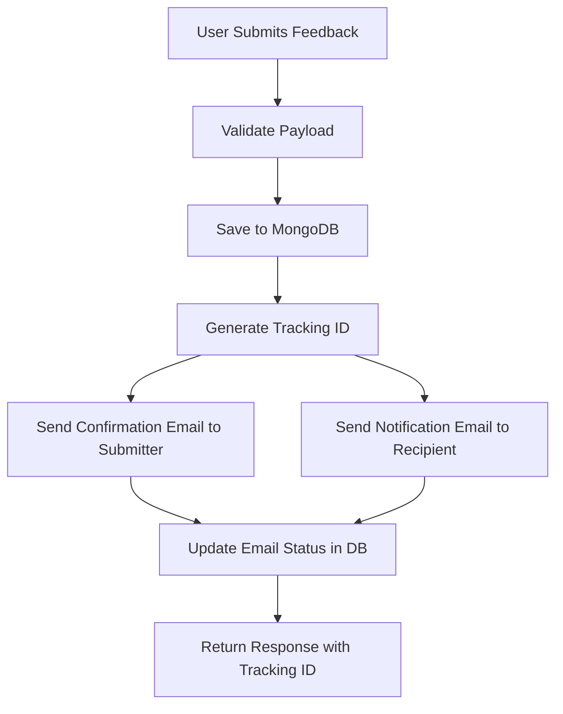

# Feedback System Documentation

The Naradh Email Service includes a comprehensive feedback system that enables dual email notifications and MongoDB storage for feedback management across multiple applications and features.

## 🚀 Quick Start

### 1. Environment Setup

Add these variables to your `.env` file:

```bash
# MongoDB Configuration
MONGODB_URI=mongodb://localhost:27017/Naradh

# Feedback System Configuration
COMPANY_NAME=Your Company Name
SUPPORT_EMAIL=support@yourcompany.com
FEEDBACK_DASHBOARD_URL=https://dashboard.yourcompany.com/feedback
FEEDBACK_RESPOND_URL=https://dashboard.yourcompany.com/feedback/respond
FEEDBACK_API_PORT=3001

# Email Configuration (already setup in main system)
RESEND_API_KEY=your_resend_api_key
RESEND_FROM_EMAIL=onboarding@resend.dev
```

### 2. Start the Feedback API Server

```bash
npm run start:feedback-api
# or
npx ts-node server/feedback-api.ts
```

### 3. Submit Feedback via API

```bash
curl -X POST http://localhost:3001/api/feedback/submit \
  -H "Content-Type: application/json" \
  -d '{
    "submitter": {
      "name": "John Doe",
      "email": "john@customer.com",
      "role": "Customer"
    },
    "recipient": {
      "name": "Jane Smith",
      "email": "jane@company.com",
      "role": "Product Manager"
    },
    "feedback": {
      "content": "Great feature! Very intuitive.",
      "rating": 5,
      "type": "positive",
      "priority": "medium"
    },
    "context": {
      "applicationName": "Web App",
      "featureName": "User Dashboard"
    }
  }'
```

## 📋 System Overview

### Core Components

1. **FeedbackService** - Main business logic for feedback processing
2. **MongoDB Integration** - Persistent storage with analytics capabilities
3. **Dual Email System** - Automatic notifications to both submitter and recipient
4. **REST API** - HTTP endpoints for feedback submission and management
5. **Beautiful Templates** - Professional HTML email templates

### Workflow



## 🏗️ Architecture

### Data Structure

```typescript
interface FeedbackSubmissionPayload {
  submitter: {
    name: string;
    email: string;
    role?: string;
    userId?: string;
  };
  
  recipient: {
    name: string;
    email: string;
    role?: string;
    team?: string;
  };
  
  feedback: {
    content: string;
    rating: number; // 1-5
    type: 'positive' | 'negative' | 'suggestion' | 'bug' | 'feature_request';
    priority?: 'low' | 'medium' | 'high' | 'critical';
    category?: string;
  };
  
  context: {
    applicationName: string;
    featureName: string;
    version?: string;
    environment?: 'production' | 'staging' | 'development';
    userAgent?: string;
    url?: string;
  };
  
  metadata?: {
    attachments?: string[];
    tags?: string[];
    customFields?: Record<string, any>;
    sessionId?: string;
    timestamp?: string;
  };
}
```

### MongoDB Schema

The system automatically creates indexes for optimal query performance:

- Single field indexes: submitter.email, recipient.email, context.applicationName, etc.
- Compound indexes: applicationName + featureName + feedbackType
- Automatic tracking ID generation via pre-save middleware

## 📧 Email Templates

### Confirmation Email (for Submitter)
- **Purpose**: Thank the user for their feedback
- **Features**: 
  - Personalized thank you message
  - Feedback summary with rating display
  - Tracking ID for reference
  - Next steps information
  - Contact information for support

### Notification Email (for Recipient)
- **Purpose**: Alert team members about new feedback
- **Features**:
  - Priority indicators and emojis
  - Complete feedback details
  - Submitter information with avatar
  - Context and environment data
  - Action buttons (Dashboard, Respond, Email)
  - Type-specific action suggestions

## 🎯 API Endpoints

### POST /api/feedback/submit
Submit new feedback with dual email notifications.

**Request Body**: `FeedbackSubmissionPayload`

**Response**:
```typescript
{
  success: boolean;
  message: string;
  feedbackId?: string;
  trackingId?: string;
  estimatedResponseTime?: string;
  emailsSent: {
    submitterNotified: boolean;
    recipientNotified: boolean;
  };
  error?: string;
}
```

### GET /api/feedback/analytics
Get aggregated feedback statistics.

**Query Parameters**:
- `applicationName` (optional): Filter by specific application

**Response**:
```typescript
{
  success: boolean;
  data: {
    totalFeedbacks: number;
    averageRating: number;
    positiveCount: number;
    negativeCount: number;
    suggestionCount: number;
    bugCount: number;
    featureRequestCount: number;
  };
}
```

### GET /api/feedback/recent
Get recent feedback with optional filters.

**Query Parameters**:
- `applicationName`: Filter by application
- `featureName`: Filter by feature
- `feedbackType`: Filter by type
- `minRating`, `maxRating`: Filter by rating range
- `limit`: Maximum number of results (default: 50)

### PATCH /api/feedback/:id/status
Update feedback status.

**Request Body**:
```typescript
{
  status: 'new' | 'reviewed' | 'in_progress' | 'resolved' | 'dismissed';
  reviewerId?: string;
}
```

### POST /api/feedback/test
Submit test feedback with sample data for development.

### GET /api/feedback/schema
Get the complete payload schema for validation.

## 🔧 Usage Examples

### Programmatic Usage

```typescript
import { EmailService } from './src/EmailService';
import { FeedbackService } from './src/services/FeedbackService';

const emailService = new EmailService();
const feedbackService = new FeedbackService(emailService);

// Submit feedback
const result = await feedbackService.submitFeedback({
  submitter: {
    name: "Alice Johnson",
    email: "alice@customer.com"
  },
  recipient: {
    name: "Bob Smith", 
    email: "bob@company.com"
  },
  feedback: {
    content: "Love the new feature!",
    rating: 5,
    type: "positive"
  },
  context: {
    applicationName: "Web App",
    featureName: "Dashboard"
  }
});

console.log('Tracking ID:', result.trackingId);
```

### Frontend Integration

```javascript
// Submit feedback from your frontend
const submitFeedback = async (feedbackData) => {
  const response = await fetch('/api/feedback/submit', {
    method: 'POST',
    headers: {
      'Content-Type': 'application/json'
    },
    body: JSON.stringify(feedbackData)
  });
  
  const result = await response.json();
  if (result.success) {
    alert(`Feedback submitted! Tracking ID: ${result.trackingId}`);
  }
};
```

### Bulk Processing

```typescript
import { processBatchFeedback } from './examples/feedback-usage';

const feedbackList = [
  // ... array of feedback objects
];

const results = await processBatchFeedback(feedbackList);
console.log(`Processed ${results.length} feedback items`);
```

## 📊 Analytics & Reporting

### Built-in Analytics

The system provides aggregated statistics:

```typescript
const analytics = await feedbackService.getAnalytics('MyApp');
console.log('Average Rating:', analytics.averageRating);
console.log('Total Feedback:', analytics.totalFeedbacks);
```

### Custom Queries

Direct MongoDB access for custom analytics:

```typescript
import { FeedbackModel } from './src/models/Feedback';

// Get feedback by date range
const recentFeedback = await FeedbackModel.find({
  createdAt: { $gte: new Date('2024-01-01') }
});

// Get feedback by rating
const highRatedFeedback = await FeedbackModel.findByRating(4, 5);
```

## 🎨 Customization

### Custom Email Templates

1. Create new `.hbs` template files in the `templates/` directory
2. Use Handlebars helpers for dynamic content:
   - `{{uppercase text}}`
   - `{{ratingStars rating}}`
   - `{{formatDate date}}`
   - `{{substring text 0 1}}`

### Custom Fields

Add application-specific data using the `metadata.customFields` object:

```typescript
metadata: {
  customFields: {
    purchaseAmount: 99.99,
    membershipLevel: "Premium",
    campaignId: "summer2024"
  }
}
```

### Email Configuration

Override default email settings:

```typescript
const feedbackService = new FeedbackService(emailService);

// Custom confirmation message
process.env.CUSTOM_CONFIRMATION_MESSAGE = "We'll review your feedback within 24 hours";
```

## 🚀 Deployment

### Production Setup

1. **MongoDB**: Set up MongoDB instance and update `MONGODB_URI`
2. **Email Service**: Configure Resend or Nodemailer with production credentials
3. **Environment Variables**: Update all environment variables for production
4. **Monitoring**: Set up logging and monitoring for the feedback API

### Docker Deployment

```dockerfile
FROM node:18-alpine
WORKDIR /app
COPY package*.json ./
RUN npm install
COPY . .
RUN npm run build
EXPOSE 3001
CMD ["npm", "run", "start:feedback-api"]
```

### API Gateway Integration

The feedback API can be easily integrated with API gateways like AWS API Gateway, Kong, or Nginx for:
- Rate limiting
- Authentication
- Load balancing
- SSL termination

## 🔐 Security Considerations

1. **Input Validation**: All payloads are validated before processing
2. **Email Sanitization**: Email addresses are validated and sanitized
3. **Rate Limiting**: Implement rate limiting to prevent spam
4. **Authentication**: Add API authentication for production use
5. **Data Privacy**: Ensure compliance with GDPR/CCPA for user data

## 📈 Monitoring & Maintenance

### Health Checks

```bash
curl http://localhost:3001/health
```

### Logging

The system provides structured logging for:
- Feedback submissions
- Email delivery status
- Database operations
- API requests

### Database Maintenance

```typescript
// Clean up old feedback (example: older than 1 year)
await FeedbackModel.deleteMany({
  createdAt: { $lt: new Date(Date.now() - 365 * 24 * 60 * 60 * 1000) }
});
```

## 🤝 Contributing

To extend the feedback system:

1. Add new feedback types in the `feedback.types.ts` enum
2. Update email templates with new type-specific content
3. Add custom analytics methods to the FeedbackService
4. Create new API endpoints for specific use cases

## 📞 Support

For issues with the feedback system:

1. Check the logs for error messages
2. Verify MongoDB and email service connections
3. Test with the `/api/feedback/test` endpoint
4. Review environment variable configuration

---

**Happy Feedback Collection! 🎉** 